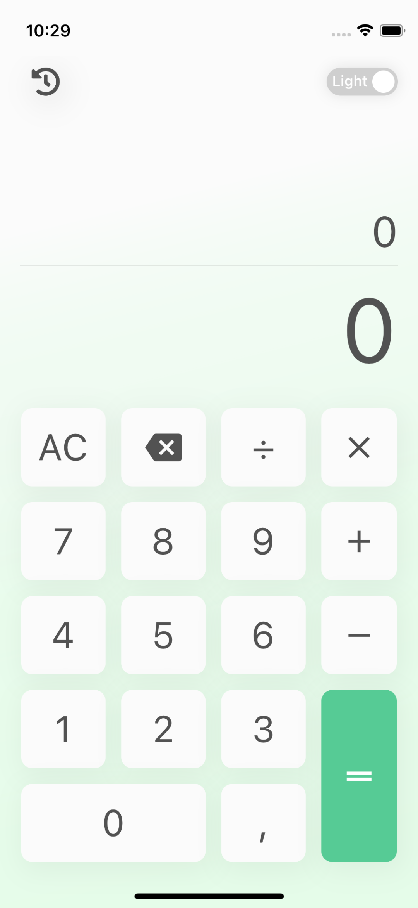
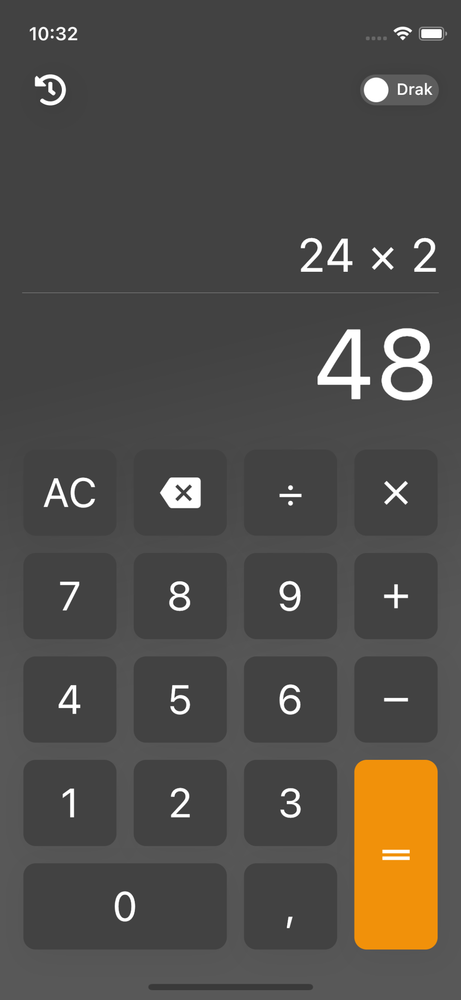
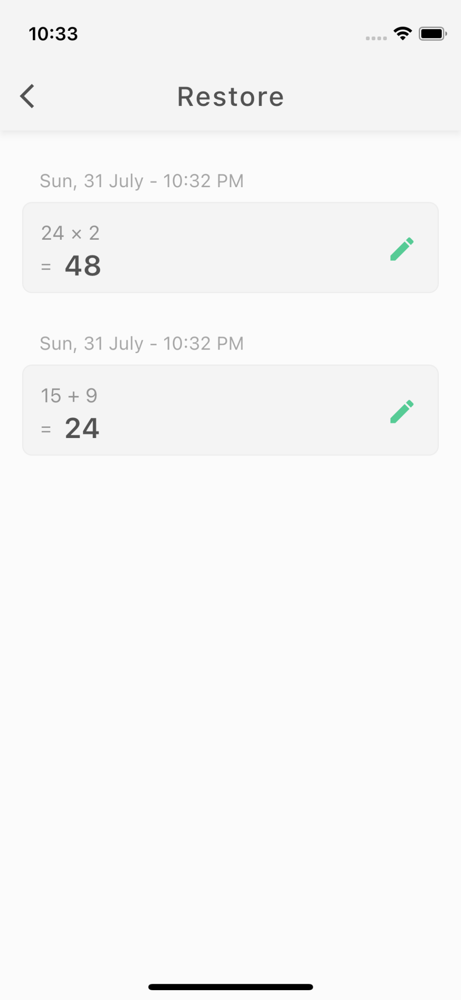
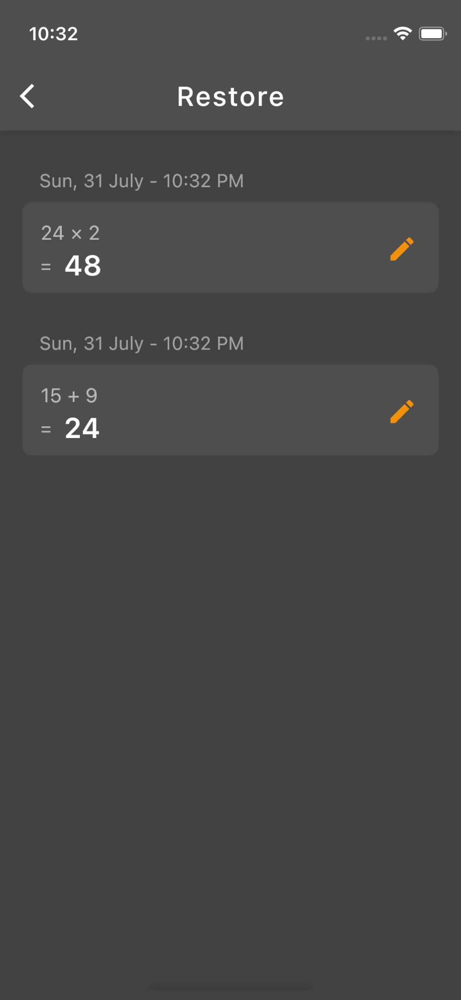

# flutter_caculator

- A new Flutter project.

- Name app: Calculator

- CopyRight by: @2022 Pt Nguyen

- Description: App Calculator is one app to practice Flutter with state management Flutter Bloc

- Project packaget
  cupertino_icons: ^1.0.2
  auto_size_text: ^3.0.0
  intl: ^0.17.0
  math_expressions: ^2.3.0
  flutter_svg: ^1.0.3
  animations: ^2.0.2
  flutter_bloc: ^8.0.1
  equatable: ^2.0.3

- Some Images

